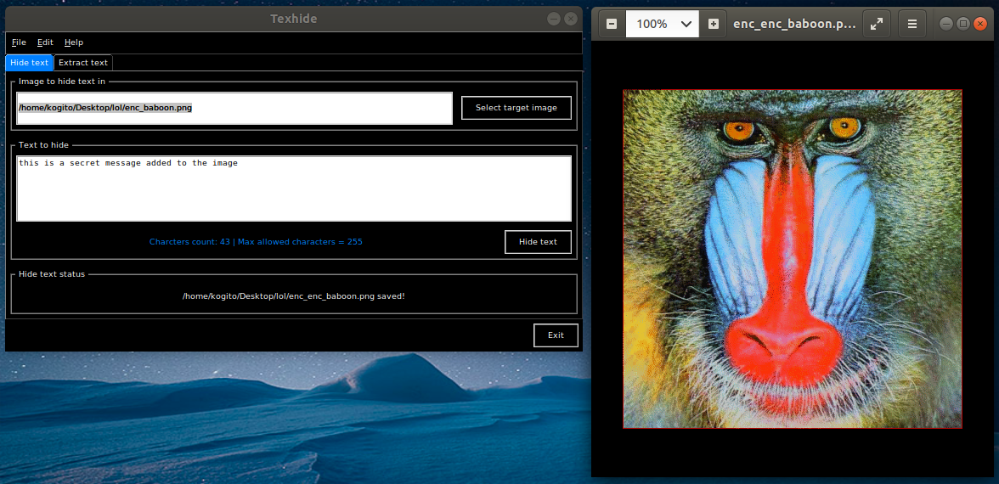
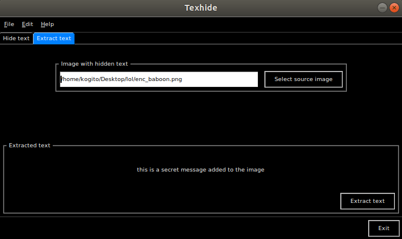

# Texhide
This is a Stenography tool written in python 3. The tool has a simple tkinter gui and is aims to hide secret messages in images.

The following instructions will get you a copy of the project up and running on your local machine for development and testing purposes.

## Prerequisites
In order to excute this code you will need the following python 3 packages:
* tkinter package
```
sudo apt-get install python3-tk
```
* PIL package (used for the pygame.mixer to play the mp3 sample)
```
pip install Pillow
```

## Tests
This code has been only tested on ubuntu 16.04

## Deployment
Navigate to folder and extract mp3_samples.tar.xz file. This will result in a folder with all the mp3 samples used by the code. Then you can run this code either by using a python IDE or by running the following command in the terminal:
```
python3 main.py
```
## Screenshots



## Built With
* [Spyder3](http://pythonhosted.org/spyder/)

## Contributing
If you have any improvement's suggestions, please contact me.

## License

This project is licensed under the MIT License - see the [LICENSE.md](LICENSE.md) file for details

## Acknowledgments and ressources

* The nameless heros of Stackoverflow
* The following snippets: [hide-private-message-in-an-image-python](https://www.daniweb.com/programming/software-development/code/485063/hide-private-message-in-an-image-python)
